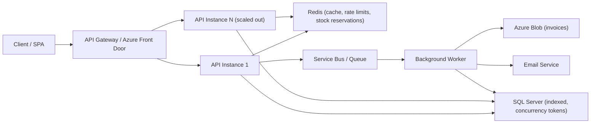

# ECommerceBackend — Architecture Guide

> **Target framework:** .NET 8 &nbsp;|&nbsp; **Style:** Clean Architecture
> **Focus areas:** Scalability, Concurrency, Thread Safety, System Design

---

## Table of Contents
1. [Project Overview](#1-project-overview)
2. [Current State Assessment](#2-current-state-assessment)
3. [Findings & Recommendations](#3-findings--recommendations)
4. [Deep Dive: Concurrency Scenarios](#4-deep-dive-concurrency-scenarios)
5. [Scaling the Monolith](#5-scaling-the-monolith)
6. [Target Architecture](#6-target-architecture)
7. [Implementation Roadmap](#7-implementation-roadmap)

---

## 1. Project Overview

The solution follows **Clean Architecture** with clear layering:

| Layer | Responsibility |
|-------|----------------|
| `ECommerceBackend.API` | Controllers, `Program.cs`, JWT auth, rate limiting, CORS |
| `ECommerceBackend.Application` | Services, DTOs, interfaces (business logic) |
| `ECommerceBackend.Domain` | Entities (core model) |
| `ECommerceBackend.Infrastructure` | EF Core `AppDbContext`, repositories, Azure Blob |

**Solid foundations already in place:** repository pattern, JWT authentication, rate limiting,
AutoMapper, and Azure Blob Storage for invoices.

---

## 2. Current State Assessment

What the codebase supports today vs. what needs to be added.

| Capability | Status | Notes |
|-----------|--------|-------|
| Clean Architecture (4 layers) | Done | Strong foundation |
| EF Core + SQL Server (v9) | Done | `EnableRetryOnFailure` for transient faults |
| Cart transaction + concurrency token | Done | `RowVersion` migration applied |
| JWT (stateless auth) | Done | Ready for horizontal scaling |
| Options pattern (`AzureBlobOptions`) | Done | Clean config binding |
| Rate limiting | Moved to gateway | In-app limiter removed; enforced at Front Door / APIM (Section 8) |
| `BlobServiceClient` reuse | Done | Registered as singleton |
| Redis (reservations, idempotency, locks) | Done | `StackExchange.Redis`; hot-path stock reservations |
| Background workers | Done | Sweeper, outbox processor, reconciliation (all lock-guarded) |
| Product/Stock inventory | Done | `Product` entity + atomic stock deduction; `GET /api/products` |
| Redis reserve-and-confirm inventory | Done | Dual-write + sweeper + lazy load + warm-up |
| Idempotency | Done | 3 layers: request / confirm / settlement |
| Outbox pattern | Done | Crash-safe Redis<->SQL settlement |
| Two-step checkout + Payment API | Done | `/checkout/begin` + `/payment/pay` (dummy) |
| Background invoice + email | Done | Moved into the outbox worker |
| Global exception handling | Done | `GlobalExceptionHandler` + `ProblemDetails` |
| Health checks / resiliency | Done | `/health` (SQL + Redis) + EF retry + outbox dead-letter |
| Redis distributed cache (products + cart read) | Done | Cache-aside `ProductCache` (paged + per-id) & `CartCache` (per-user, invalidated on write); 5-10min TTL |
| Azure Service Bus queue | Missing | Outbox ready to publish to it |
| Multi-instance deploy (App Service) | Pending | Code is multi-instance safe (locks); deploy TBD |

---

## 3. Findings & Recommendations

### 3.1 Critical Bugs & Thread Safety

**Blocking async calls (`.Wait()`)** — In `CheckoutController.Checkout`, `.Wait()` blocks a
thread-pool thread and can deadlock under load. Replace with `await` inside a `try/catch`.
**Highest-priority fix.**
```csharp
// Before
_orderedItemService.HandleInvoice(...).Wait();

// After
try
{
    await _orderedItemService.HandleInvoice(
        invoiceDataModel.UserId, pdfBytes, orderItems.Count,
        orderItems.Sum(i => i.TotalPrice) + 30);
}
catch (Exception ex)
{
    _logger.LogError(ex, "Error saving invoice for user {UserId}", invoiceDataModel.UserId);
}
```

**`BlobServiceClient` per request** — `new BlobServiceClient(...)` on every call risks socket
exhaustion. Register once as a **singleton** (thread-safe) and inject it. Call
`CreateIfNotExistsAsync` once at startup.
```csharp
builder.Services.AddSingleton(sp =>
{
    var options = sp.GetRequiredService<IOptions<AzureBlobOptions>>().Value;
    return new BlobServiceClient(options.ConnectionString);
});
```

**Cart update atomicity — DONE** — `ApplyCartDiffAsync` now runs the whole add/update/remove diff
in **one transaction** with a `RowVersion` concurrency token + retry (see Section 4.1).
> EF Core `DbContext` is **not thread-safe** — never share one across parallel tasks in a request.

### 3.2 Data Layer & Query Concerns

| # | Issue | Fix |
|---|-------|-----|
| D1 | Read queries track entities unnecessarily | Add `.AsNoTracking()` to read-only queries |
| D2 | Missing indexes | Index `CartItem.UserId`, `UserInvoice.UserId` |
| D3 | Unbounded invoice list | Paginate `GetInvoicesByUserIdAsync` (`Skip`/`Take`) |
| D4 | Unsafe cast `(List<UserInvoice>)await ...` | Use `.ToList()` or return `IReadOnlyList<>` |

### 3.3 Code Quality & Consistency

| # | Issue | Recommendation |
|---|-------|----------------|
| Q1 | Inconsistent service lifetimes | Prefer **Scoped** for DbContext-consuming services |
| Q2 | `Console.WriteLine` used for logging | Use structured `ILogger` |
| Q3 | Scattered `try/catch` | Global `IExceptionHandler` (.NET 8) returning `ProblemDetails` |
| Q4 | Controllers reference concrete `Infrastructure.Repositories` | Depend only on `Application` abstractions |
| Q5 | Raw `throw new Exception(...)` | Use typed/domain exceptions |
| Q6 | No health checks / resiliency | `AddHealthChecks()` + `Polly` / EF `EnableRetryOnFailure` |
| Q7 | Secrets/URLs hard-coded | User Secrets (dev) / Key Vault (prod); config-driven CORS |
| Q8 | Missing `UseHttpsRedirection`, `UseForwardedHeaders` | Add for security + correct client IP behind proxy |

### 3.4 Scalability & System Design

| # | Concept | Summary |
|---|---------|---------|
| S1 | **Distributed cache (Redis)** | Cache-aside for cart/products so instances share state |
| S2 | **Background queue** | Offload invoice PDF + email to a worker via Service Bus / RabbitMQ |
| S3 | **Idempotency** | `Idempotency-Key` header to make checkout retries safe |
| S4 | **Gateway rate limiting** | Enforced at the edge (Front Door WAF / APIM), not in app code |
| S5 | **Statelessness** | JWT already stateless — keep no in-process session state |

---

## 4. Deep Dive: Concurrency Scenarios

Two **different** races that need **different** fixes.

### 4.1 Cart Race Condition (user's own rows)

**Problem:** two concurrent updates to the same user's cart interleave -> lost update / partial state.

**Fix (implemented):**
- Wrap the whole diff in **one transaction** (`ExecuteInTransactionAsync`) -> all-or-nothing.
- Add `[Timestamp] byte[] RowVersion` to `CartItem` -> EF adds it to the `WHERE` clause;
  a concurrent edit causes `DbUpdateConcurrencyException`, handled by a **retry loop**.

> Single-database operation -> a **local transaction** is enough (no Saga / 2PC).

### 4.2 Inventory Oversell (shared resource)

**Problem:** stock = 10, two users each order 8. Both read "10 >= 8" and deduct -> oversold.
> **Not guarded today** — the backend has no `Product`/`StockQuantity` entity.

| Approach | Correct? | Concurrency | Complexity | Use when |
|----------|----------|-------------|------------|----------|
| **Atomic conditional UPDATE** | Yes | High | Low | **Default choice** |
| Optimistic (`RowVersion`) | Yes | High | Medium | Extra per-product logic |
| Pessimistic lock | Yes | Low | Medium | High-value, rare writes |
| Reserve + TTL (Redis) | Yes | High | High | Real checkout / flash sales |

**Recommended start — atomic conditional UPDATE** (DB serializes concurrent orders):
```csharp
int rows = await _context.Products
    .Where(p => p.Id == id && p.StockQuantity >= qty)
    .ExecuteUpdateAsync(s => s.SetProperty(p => p.StockQuantity, p => p.StockQuantity - qty));

if (rows == 0) throw new InsufficientStockException();   // 0 rows = not enough stock
```

**Large-scale pattern — Reserve -> Confirm -> Settle:**
```
1. RESERVE (fast, Redis atomic DECRBY / Lua)  - hold stock with a TTL
2. CONFIRM (on payment success)               - reservation -> real order
3. SETTLE  (async to SQL via queue + worker)  - durable source of truth
4. RELEASE (on timeout/failure)               - return stock automatically
```
**Flash-sale extras:** pre-load stock into Redis, shard the counter, virtual waiting room, CDN for product pages.

---

## 5. Scaling the Monolith

> **You do NOT need microservices to scale.** Keep the monolith; run **multiple identical
> instances behind a load balancer.**

### The #1 Rule: Be Stateless
No instance may hold request-specific state in memory (the next request may hit another instance).

| Feature | Scalable? | Why |
|---------|-----------|-----|
| JWT auth | Yes | Self-contained token; any instance validates it |
| Cart in SQL | Yes | Shared DB |
| Invoices in Blob | Yes | Shared external storage |
| Rate limiter (in-memory) | No | Per-instance counts multiply -> needs Redis |

### Hosting (Azure — already using Blob)
| Option | Best for | Scaling |
|--------|----------|---------|
| **Azure App Service** | Easiest — deploy + "scale out" | Auto-scales instance count |
| Azure Container Apps | Containerized, serverless scaling | Scale to zero / many |
| Azure Kubernetes Service | Large, complex systems | Full control |

---

## 6. Target Architecture



---

## 7. Implementation Roadmap

Phased delivery — each phase is independently shippable and testable.

### Phase 1 — Quick Wins (code-only, low risk)
1. Remove `.Wait()` -> `await` in `CheckoutController` *(thread safety)*
2. Singleton `BlobServiceClient` + inject into `OrderedItemService` *(resource pooling)*
3. `AsNoTracking()` on read queries *(D1)*
4. Fix unsafe cast in `GetInvoicesByUserIdAsync` *(D4)*
5. Consistent `Scoped` service lifetimes *(Q1)*
6. `ILogger` instead of `Console.WriteLine` *(Q2)*
7. Global exception handling + `ProblemDetails` *(Q3)*
8. `UseHttpsRedirection` + `UseForwardedHeaders` *(Q8)*
9. Config-driven CORS + secrets in User Secrets/Key Vault *(Q7)*

### Phase 2 — Inventory Correctness (new entity, medium) — DONE
10. ? Cart `RowVersion` migration applied
11. ? `Product` entity (full fakestoreapi schema) + `StockQuantity` + seed data
12. ? Atomic stock deduction in checkout (returns 409 on insufficient stock) *(4.2)*
13. ? Indexes on `CartItem.UserId` / `UserInvoice.UserId`
14. ? `GET /api/products` + `GET /api/products/{id}` (serve catalog + live stock) — now **paged +
    category-filtered** (`?page=&pageSize=&category=`) with an index on `Product.Category`

> ?? Run `Add-Migration AddProductsAndIndexes` + `Update-Database` to apply the `Products`
> table, seed data, and indexes.

### Phase 3 — Distributed State (Redis) — mostly DONE
14. ? Redis distributed **read** cache for products + cart (cache-aside) *(S1)*
    — `ProductCache` (paged + per-id, 5-min TTL) & `CartCache` (per-user, 10-min TTL, invalidated on write)
15. ? Idempotency keys on checkout *(S3)* — 3 layers (request / confirm / settlement)
16. ? Configure **gateway rate limiting** (Front Door WAF / APIM) *(S4)* — infra, see Section 8

### Phase 4 — Async Processing & Infrastructure — mostly DONE
17. ? Azure Service Bus queue *(S2)* — outbox is ready to publish to it (infra/Azure)
18. ? Background worker for invoice PDF + email *(S2)* — moved into the outbox processor
19. ? Redis reserve-and-confirm inventory *(4.2)* — dual-write + sweeper + lazy load + warm-up
20. ? Health checks + resiliency *(Q6)* — `/health` (SQL+Redis), EF `EnableRetryOnFailure`, outbox dead-letter
21. ? Deploy multiple instances (App Service auto-scale) *(Section 5)* — code is lock-guarded & ready

**Also completed (beyond the original plan):**
- ? **Order tables** (`Orders` + `OrderItems`) — durable reserved-set snapshot
- ? **Outbox pattern** — crash-safe Redis<->SQL settlement (atomic capture + relay)
- ? **Two-step checkout** — `/checkout/begin` (reserve) + `/payment/pay` (dummy payment)
- ? **Reconciliation job** — self-heals Redis<->SQL drift + fails expired orders
- ? **Distributed locks** — generic lock guarding sweeper, outbox, reconciliation

### Remaining (infra / Azure)
- Gateway rate limiting (S4) — Front Door WAF / APIM
- Azure Service Bus (S2) — swap outbox relay to publish
- Multi-instance deployment (App Service auto-scale)
- Secrets to User Secrets / Key Vault (Q7)

> **Guidance:** the remaining items are largely **Azure infrastructure**; the application code
> is already multi-instance safe and queue-ready.

---

## 8. Gateway-Level Rate Limiting

**Decision:** rate limiting is enforced at the **edge/gateway**, not in the application.
The in-app ASP.NET rate limiter (`AddRateLimiter` / `[EnableRateLimiting]`) has been **removed**.

### Why the gateway
- Excess traffic is rejected **before** it reaches the app (saves CPU/DB).
- **Centralized** and naturally **distributed** — no per-instance counters, no Redis needed for limits.
- Protects all instances uniformly.

### Request flow
```
User -> Front Door (WAF rate limit) -> [optional APIM] -> Load Balancer -> API instances
```

### Limits to configure (mirroring the removed in-app policies)
| Scope | Path match | Limit |
|-------|-----------|-------|
| Auth (login/register) | `/api/auth/` | 5 / min per IP |
| Refresh token | `/api/auth/refresh-token` | 10 / min per IP |
| General API (cart, invoices) | `/api/` | 30 / min per IP |
| Global | all | 100 / min per IP |

### Option A — Azure Front Door WAF (edge)
- Rate limit via **WAF custom rules** matching `RequestUri`.
- **Windows:** 1 or 5 minutes only. **Key:** client IP.
- Put more specific paths (e.g., `refresh-token`) at a **lower priority number** so they match first.
- Best when you also want **CDN + global edge + DDoS** protection.

### Option B — Azure API Management (fine-grained)
- `rate-limit-by-key` / `quota-by-key` policies per operation.
- **Any window** (seconds/minutes) and richer keys (IP, subscription, user).
- Best when you need **exact per-endpoint limits** like the old code.

```xml
<inbound>
    <rate-limit-by-key calls="5" renewal-period="60"
        counter-key="@(context.Request.IpAddress)" />
</inbound>
```

### Recommended: defense in depth
```
Front Door (edge WAF, coarse limits + DDoS)
        -> APIM (precise per-endpoint limits)
        -> App Service (locked down: only gateway can reach it)
```

### Critical: lock down the backend
Restrict App Service so traffic **only** comes through the gateway (access restrictions /
`X-Azure-FDID` header check / VNet). Otherwise clients bypass the gateway and skip rate limiting.

> **Note:** `UseForwardedHeaders()` is still required in the app so logs record the **real client IP**
> forwarded by the gateway.

---

*Generated as an architecture review for the ECommerceBackend solution.*
