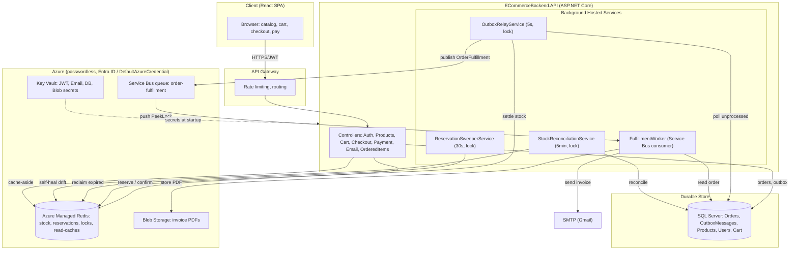
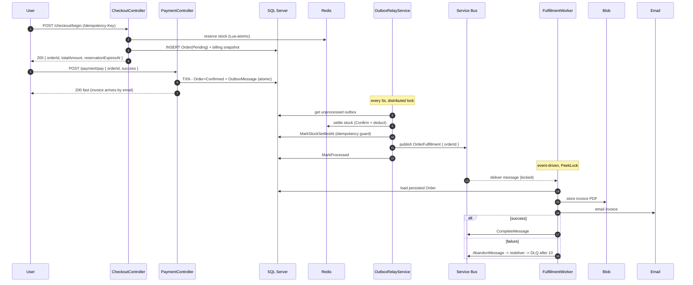

# E-Commerce Backend

A production-grade **.NET 8** e-commerce backend built with **Clean Architecture**, designed for
**high-contention flash-sale inventory**. It combines a **Redis** hot path for stock reservations,
the **Transactional Outbox** pattern for crash-safe settlement, and **Azure Service Bus** for
reliable, decoupled post-payment fulfillment - with **SQL Server** as the durable source of truth.

All Azure services (Key Vault, Managed Redis, Service Bus, Blob Storage) use **passwordless
authentication** via Microsoft Entra ID (`DefaultAzureCredential`) - **no secrets in code or
config**.

---

## Table of Contents

- [Architecture](#architecture)
  - [Solution Layout](#solution-layout-clean-architecture)
  - [System Diagram](#system-diagram)
  - [Checkout and Fulfillment Sequence](#checkout-and-fulfillment-sequence)
- [Features](#features)
- [The Checkout Pipeline](#the-checkout-pipeline-reserve-pay-fulfill)
- [Idempotency (3 Layers)](#idempotency-three-layers)
- [Background Hosted Services](#background-hosted-services)
- [Redis Key Reference](#redis-key-reference)
- [Tech Stack](#tech-stack)
- [API Endpoints](#api-endpoints)
- [Getting Started](#getting-started)
- [Configuration](#configuration)
- [Further Reading](#further-reading)

---

## Architecture

The solution follows **Clean Architecture** with strict dependency direction - outer layers depend
on inner layers, never the reverse:

```
API  -->  Application  -->  Infrastructure  -->  Domain
```

### Solution Layout (Clean Architecture)

| Project | Responsibility |
|---------|----------------|
| **`ECommerceBackend.Domain`** | Core entities (`User`, `Product`, `CartItem`, `Order`, `OrderLineItem`, `OrderStatus`, `RefreshToken`, `UserInvoice`, `OutboxMessage`). No external dependencies. |
| **`ECommerceBackend.Application`** | Business logic: services, interfaces, DTOs, models, messaging contracts, and Azure option bindings. |
| **`ECommerceBackend.Infrastructure`** | EF Core `AppDbContext`, entity configurations, repositories (SQL + Redis caches), and migrations. |
| **`ECommerceBackend.API`** | ASP.NET Core Web API: controllers, background hosted services, Service Bus messaging, filters, and the composition root (`Program.cs`). |

### System Diagram



### Checkout and Fulfillment Sequence



---

## Features

- **Authentication and Security**
  - JWT Bearer auth with refresh tokens (HTTP-only cookie)
  - Azure Key Vault for all secrets (passwordless)
  - CORS, RFC 7807 `ProblemDetails` global exception handling, forwarded-headers support
  - Rate limiting enforced at the **API Gateway** (not in-app)

- **High-Contention Inventory (Redis hot path)**
  - Lua-atomic stock reservations - no oversell under thousands of concurrent buyers
  - Dual-write reservation (functional key + ZSET expiry tracker)
  - TTL-based hold while the user pays, reclaimed automatically if abandoned

- **Reliable, Decoupled Fulfillment**
  - Transactional **Outbox** for crash-safe capture of the settlement intent
  - **Azure Service Bus** transport with independent retries + automatic dead-lettering
  - Slow work (invoice PDF + email) fully off the request/settlement path

- **Invoicing** - QuestPDF invoice generation, emailed via SMTP, persisted to Blob/SQL

- **Catalog and Cart**
  - Cache-aside read-caches for products and carts (Redis)
  - Offset **and** keyset (cursor / "Load more") pagination - scales to 1M+ products

- **Self-Healing** - background reconciliation of Redis and SQL stock drift

- **Observability** - `/health` checks for SQL Server and Redis

---

## The Checkout Pipeline (Reserve, Pay, Fulfill)

A **two-step** checkout that keeps the hot path fast and correctness-critical work deterministic:

```
STEP 1 - POST /checkout/begin  (Idempotency-Key header, [Idempotent] filter)
   - reserve stock in Redis (Lua-atomic; lazy-loads from SQL on a cache miss)
   - INSERT Order(Pending) + line items + billing snapshot
   - rolls back reservations on any partial failure
   => 200 { orderId, totalAmount, reservationExpiresAt }

STEP 2 - POST /payment/pay { orderId, success }
   - success -> ConfirmStockAsync
                SQL txn: Order=Confirmed + OutboxMessage   (ATOMIC - dual-write fixed)
                => 200 fast
   - failure -> ReleaseStockAsync (Redis INCRBY + Order=Failed) -> 402

BACKGROUND - OutboxRelayService (every 5s, distributed-locked)
   settle stock INLINE (Redis Confirm + SQL deduct) -> MarkStockSettledAt -> publish to Service Bus

BACKGROUND - FulfillmentWorker (Service Bus consumer)
   generate invoice PDF (from the persisted Order) -> email -> persist invoice record
   (auto retry + dead-letter via Service Bus)
```

> **Why split settlement from fulfillment?** Stock settlement is *fast and correctness-critical*, so
> it stays inline under a distributed lock. The *slow, retry-prone* work (PDF + external email) is
> handed to Service Bus, so a flaky email provider can never block inventory or the checkout
> response.

**Stock values at each stage** (start = 100 units, reserve 8):

| Stage | Redis `stock` | SQL `StockQuantity` | Meaning |
|-------|:--:|:--:|---------|
| Before checkout | 100 | 100 | in sync |
| After reserve | 92 | 100 | 8 held (not sold) |
| After confirm | 92 | 100 | settlement pending |
| After outbox settle | 92 | 92 | fully in sync - sold |
| If abandoned/expired | 100 (swept back) | 100 | released |

---

## Idempotency (Three Layers)

Because queues + network retries deliver **at-least-once**, the system is safe against duplicate
processing at three independent levels:

| Layer | Guard | Protects against |
|-------|-------|------------------|
| **Request** | `[Idempotent]` filter (Redis `SET NX` on `Idempotency-Key`) | Double-click / retry -> duplicate orders |
| **Confirm** | `Order.Status != Pending` | Re-confirming the same order |
| **Settlement** | `Order.StockSettledAt != null` | Outbox / Service Bus reprocessing -> double stock deduction |

---

## Background Hosted Services

Each runs on **every** instance but is guarded by a **Redis distributed lock** so only one instance
acts per cycle (multi-instance safe).

| Service | Trigger | Lock key | Job |
|---------|---------|----------|-----|
| `ReservationSweeperService` | 30s | `lock:reservation-sweeper` | Reclaim expired reservations (return held stock) |
| `OutboxRelayService` | 5s | `lock:outbox-processor` | Settle stock (Redis + SQL) then **publish** to Service Bus |
| `FulfillmentWorker` | event-driven | Service Bus lease | Consume `order-fulfillment`: invoice PDF + email + persist |
| `StockReconciliationService` | 5min | `lock:stock-reconciliation` | Self-heal Redis/SQL drift + fail expired Pending orders |

---

## Redis Key Reference

| Key pattern | Type | Purpose |
|-------------|------|---------|
| `stock:{productId}` | STRING (int) | Live available counter (authoritative hot path) |
| `reservation:{orderId}:{productId}` | STRING + TTL | One reservation hold |
| `reservations:index` | ZSET | Expiry tracker (member=`orderId:productId:qty`, score=expiry) |
| `idempotency:{key}` | STRING + TTL | Duplicate-request guard (`[Idempotent]`) |
| `lock:*` | STRING (NX+EX) | Distributed locks for background jobs |
| `cache:products:page:*` / `cache:products:cursor:*` | STRING (JSON) | Catalog read-cache (offset / keyset), TTL 5m |
| `cache:products:{productId}` | STRING (JSON) | Single product detail, TTL 5m |
| `cache:cart:{userId}` | STRING (JSON) | Cart read-cache, TTL 10m, invalidated on write |

> **Namespacing = tables.** Prefixes let `SCAN stock:*` enumerate only stock keys (never blocking
> `KEYS`). `VolatileLRU` eviction only touches keys with a TTL - authoritative `stock:` /
> `reservation:` keys are protected.

---

## Tech Stack

| Concern | Technology |
|---------|-----------|
| Runtime | .NET 8 / ASP.NET Core Web API |
| Persistence | SQL Server + Entity Framework Core (with `EnableRetryOnFailure`) |
| Cache / hot path | Azure Managed Redis (StackExchange.Redis, Lua scripts) |
| Messaging | Azure Service Bus (`Azure.Messaging.ServiceBus`) |
| Secrets | Azure Key Vault (`DefaultAzureCredential`) |
| File storage | Azure Blob Storage |
| PDF generation | QuestPDF |
| Object mapping | AutoMapper |
| Auth | JWT Bearer + refresh tokens |

---

## API Endpoints

| Method | Route | Auth | Description |
|--------|-------|:----:|-------------|
| `POST` | `/api/auth/login` | No | Authenticate, issue access + refresh tokens |
| `POST` | `/api/auth/register` | No | Register a new user |
| `POST` | `/api/auth/refresh-token` | Cookie | Atomically rotate the refresh token and issue a new access token |
| `POST` | `/api/auth/logout` | Cookie | Revoke the current refresh-token family and clear the cookie (204) |
| `GET`  | `/api/products` | No | Paged catalog (offset), optional `?category=` |
| `GET`  | `/api/products/feed` | No | Keyset "Load more" feed (`?afterId=&pageSize=`) |
| `GET`  | `/api/products/{id}` | No | Single product |
| `POST` | `/api/products/warmup` | Admin | Pre-warm Redis stock for a sale |
| `GET`  | `/api/cart/getItems` | Yes | Get the user's cart |
| `POST` | `/api/cart/update` | Yes | Apply a cart diff (add/update/remove) |
| `POST` | `/api/checkout/begin` | Yes | **Step 1** - reserve stock + create Pending order (`[Idempotent]`) |
| `POST` | `/api/payment/pay` | Yes | **Step 2** - confirm (success) or release (failure) |
| `GET`  | `/api/orderedItems/get-invoice` | Yes | Fetch a user's invoices |
| `GET`  | `/health` | No | SQL + Redis health checks |

---

## Authentication sessions

Login, registration, and refresh retain the `{ AccessToken, UserId }` response shape.
Refresh tokens are returned only in the `refreshToken` cookie (`HttpOnly`, `Secure`,
`SameSite=None`, path `/`, seven-day lifetime). SQL stores SHA-256 hashes of random
64-byte tokens, never their plaintext values, with a unique hash index.

Rotation revokes the used token and inserts its replacement in one SQL transaction.
Every operation locks the family's root token row, serializing rotation, replay
detection, and logout even when they act on different descendants. Used tokens and
the root must be retained until the **entire family** can be deleted.

- Expired, revoked, unknown, or malformed refresh tokens return `401`.
- Reusing a rotated token revokes its whole family, including when the used token has
  expired. Other login sessions remain valid.
- Simultaneous refreshes with the same token allow only one rotation; the losing
  requests trigger replay detection and revoke that session. Clients must serialize
  refresh calls, including across tabs, rather than refresh independently per failed request.
- `POST /api/auth/logout` revokes the cookie's family and expires the cookie. Repeated
  logout, or logout without a cookie, returns `204`. It does not revoke other sessions.
- Existing access JWTs remain valid until their normal expiry; logout/replay revocation
  prevents future refreshes, not use of already-issued access tokens.

All four auth endpoints require an `Origin` header matching the API origin or an entry
in `Cors:AllowedOrigins` (default: `http://localhost:3000`). Missing, `null`, and untrusted
origins return `403` before session mutation. This explicitly protects the cross-site
cookie flow against CSRF; CORS alone is not sufficient. Browsers supply this header
automatically; API tools/scripts must include a trusted origin. Successful token responses
and handled refresh rejections use `Cache-Control: no-store`.

**Deployment:** `20260922141212_RotateHashedRefreshTokens` intentionally deletes legacy
refresh-token rows because their rotation history is unreliable. Users must sign in again.
Rolling back also deletes refresh sessions because hashes cannot be restored to plaintext.
Stop old API instances before applying the migration, then deploy the new backend; the
old token schema is not compatible with the new code. No application database migration
is run automatically by the regression suite.

Frontend code is unchanged. Its logout UI still needs to call the new endpoint, and its
refresh interceptor still needs coordinated single-flight refresh to avoid concurrent replay.

### Roles and authorization

Every `User` has a persisted `Role` (`nvarchar(20)`, defaults to `Customer`). The access
token carries it as a role claim, so `[Authorize(Roles = "Admin")]` and `User.IsInRole(...)`
are backed by real data rather than an unissued claim. Registration always creates a
`Customer`; there is deliberately **no** endpoint that grants `Admin`.

Admin-gated operations:

- `POST /api/products/warmup` — `[Authorize(Roles = "Admin")]`; non-admins get `403`.
- `POST /api/dev/reset-stock` — Development-only. The environment gate runs first (returns
  `404` in production so the endpoint stays hidden), then an `Admin` role check (`403` otherwise).

Promote a user to `Admin` out-of-band (e.g. via a DBA query); the change takes effect on
their next login, when a fresh access token is issued:

```sql
UPDATE Users SET Role = 'Admin' WHERE Email = 'you@example.com';
```

Migration `20260922155931_AddUserRole` adds the column and backfills existing rows as
`Customer`.

### Authentication verification

From `Backend\ECommerceBackend`:

```powershell
dotnet run --project ECommerceBackend.Application.Tests
dotnet run --project ECommerceBackend.Application.Tests -- --auth-sql
```

The SQL variant defaults to Windows SQL Server LocalDB (`MSSQLLocalDB`). For another test
SQL Server, set `ECOMMERCE_TEST_SQL_CONNECTION`; its database name is always replaced with
a new `ECommerceAuthTests_<guid>` database, which is deleted afterward. The account needs
permission to create/drop that isolated database. The suite covers real SQL rotation,
rollback on failed insertion, eight simultaneous refreshes, logout/replay races, session
isolation, migration upgrade/downgrade, and the HTTP cookie lifecycle.

**Known migration limitation:** the historical migration chain cannot currently bootstrap
an empty database because it references `Products` before creating it. The auth SQL suite
creates the current schema and tests this migration's downgrade/upgrade in isolation; it
does not claim that the full historical chain works. That pre-existing issue remains separate.

---

## Getting Started

### Prerequisites
- [.NET 8 SDK](https://dotnet.microsoft.com/download/dotnet/8.0)
- SQL Server (local or Azure SQL)
- Redis (local `localhost:6379` for dev, or Azure Managed Redis)
- (Optional) Azure Service Bus, Key Vault, Blob Storage for the full cloud path

### Run locally

```bash
cd Backend/ECommerceBackend

# apply EF Core migrations
dotnet ef database update --project ECommerceBackend.Infrastructure --startup-project ECommerceBackend.API

# run the API
dotnet run --project ECommerceBackend.API
```

The API starts with Swagger and exposes `/health`.

### Azure data-plane roles (passwordless)

Being subscription **Owner** is *control-plane only*. For local dev, assign your `az login` user
the **data-plane** roles, and for deployment assign them to the app's **Managed Identity**:

| Service | Required role / policy |
|---------|------------------------|
| Key Vault | Key Vault Secrets User |
| Azure Managed Redis | **Data Owner** access policy (`+@all ~*`) |
| Service Bus | Azure Service Bus Data Owner |
| Blob Storage | Storage Blob Data Contributor |

---

## Configuration

Only **non-secret** settings live in `appsettings.json` (secrets come from Key Vault):

```jsonc
{
  "KeyVaultName": "ecommerce-kv-animesh",
  "ConnectionStrings": {
    "ECommerceBackendDBConnection": "Server=...;Database=...;"
  },
  "Redis": { "HostName": "ecommerce-redis-animesh.westus.redis.azure.net" },
  "AzureServiceBus": {
    "FullyQualifiedNamespace": "ecommerce-sb-animesh.servicebus.windows.net",
    "FulfillmentQueueName": "order-fulfillment"
  },
  "Jwt": { "Issuer": "...", "Audience": "...", "Secret": "<from Key Vault>" },
  "Cors": { "AllowedOrigins": [ "http://localhost:3000" ] }
}
```

> Azure Managed Redis uses **port 10000 + TLS** and identity-based auth - there is **no** Redis
> connection-string secret. A raw `ConnectionStrings:Redis` is used only as a local-dev fallback.

---

## Further Reading

For an in-depth explanation of the Redis inventory model, the Outbox pattern, Service Bus
fulfillment, idempotency layers, and SQL synchronization, see:

**[`Notes/Redis-Inventory-And-SQL-Sync.md`](./ECommerceBackend/Notes/Redis-Inventory-And-SQL-Sync.md)**

---

Built with .NET 8, Clean Architecture, Redis, Azure Service Bus, and passwordless Azure.
